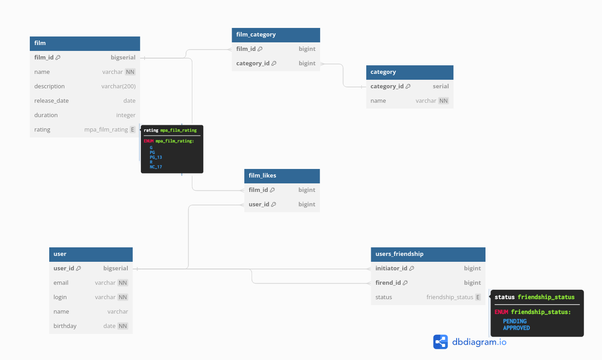

# Filmorate
сервис для оценки и рекомендации фильмов.

### &#128736; Стек:


### ✔ Функциональность:
 - добавление/изменение пользователей;
 - получение списка всех пользователей;
 - добавление/изменение фильмов;
 - получение списка всех фильмов с возможностью фильтрации и сортировки;

В командной работе реализовала:
- возможность выводить топ-N фильмов по количеству лайков;
- добавление режиссера фильма;

### 🖥️ Запуск:
1. Склонируйте репозиторий:
   ```sh
      https://github.com/BersenevaAV/filmorate.git
   ```
2. Откройте проект в IntelliJ IDEA;
3. Запустите проект на устройстве;

## Схема базы данных



### `mpa_rating`

Содержит информацию о рейтингах Motion Picture Association.

Таблица состоит из полей:

- `rating_id` — первичный ключ идентификатор рейтинга;
- `name` — название рейтинга;

### `film`

Содержит информацию о фильмах.

Таблица состоит из полей:

- первичный ключ `film_id` — идентификатор фильма;
- `title` — название фильма;
- `description` — описание фильма;
- `release_date` — дата выхода;
- `duration` — продолжительность фильма в минутах;
- `rating_id` — идентификатор рейтинга из mpa_rating;

### `genre`

Содержит информацию о жанрах фильмов.

Таблица состоит из полей:

- первичный ключ `genre_id` — идентификатор жанра;
- `name` — название жанра;

### `film_genre`

Содержит информацию о жанрах фильмов из таблицы film.

Таблица состоит из полей:

- `film_id` — идентификатор фильма из film;
- `genre_id` — идентификатор жанра из genre;

В этой таблице составной первичный ключ по полям film_id и genre_id

### `film_likes`

Содержит информацию о лайках к фильмам из таблицы film.

Таблица состоит из полей:

- `film_id` — идентификатор фильма из film;
- `user_id` — идентификатор пользователя из user;

В этой таблице составной первичный ключ по полям film_id и user_id

### `user`

Содержит информацию о пользователях.

Таблица состоит из полей:

- первичный ключ `user_id` — идентификатор пользователя;
- `email` — email пользователя [уникальное не нулевое поле];
- `login` — login пользователя [уникальное не нулевое поле];
- `name` — имя пользователя;
- `birthday` — дата рождения;

### `users_friendship`

Содержит информацию о друзьях.

Таблица состоит из полей:

- `initiator_id` — пользователь, который отправил запрос на добавление в друзья;
- `friend_id` — пользователь которому отправлен запрос в друзья;
- `status` — статус запроса, например (`PENDING`, `APPROVED`)

В этой таблице составной первичный ключ по полям initiator_id и friend_id

## Примеры запросов к бд

Запрос списка друзей пользователя с id = 1:

```sql
SELECT u.user_id,
       u.name,
       u.email,
       u.login
FROM (SELECT initiator_id AS user_id
      FROM users_friendship
      WHERE initiator_id = 1 OR friend_id = 1 AND status = 'APPROVED'

      UNION

      SELECT friend_id AS user_id
      FROM users_friendship
      WHERE initiator_id = 1 OR friend_id = 1 AND status = 'APPROVED') AS users_list
LEFT JOIN "user" AS u ON u.user_id = users_list.user_id
WHERE users_list.user_id != 1;
```

Запрос списка пользователей лайкнувших фильм с id = 1:

```sql
SELECT u.user_id,
       u.name,
       u.email
FROM film AS f
LEFT JOIN film_likes AS fl on f.film_id = fl.film_id
LEFT JOIN "user" AS u on u.user_id = fl.user_id
WHERE f.film_id = 1;
```
